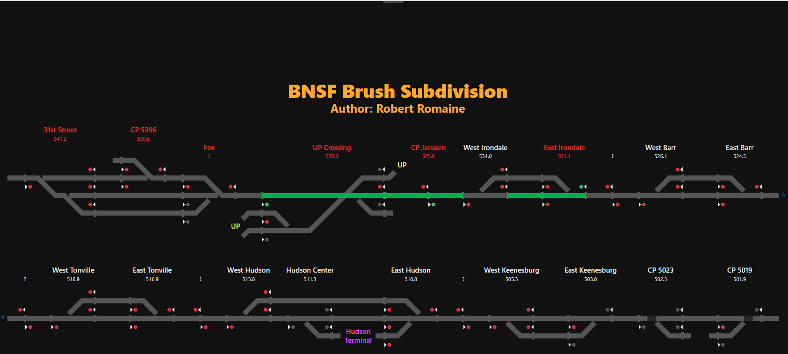
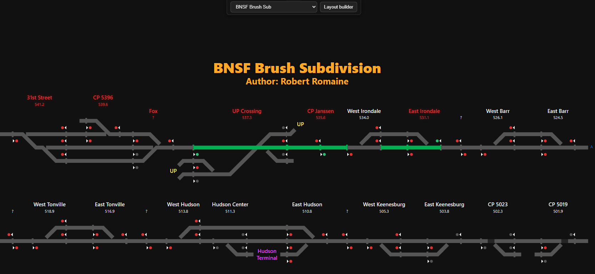
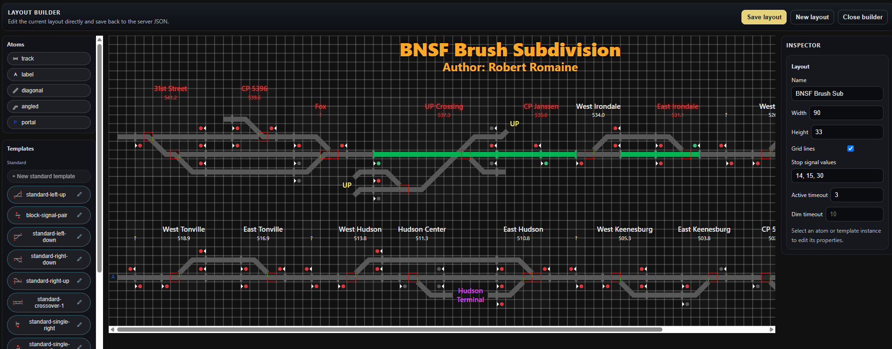
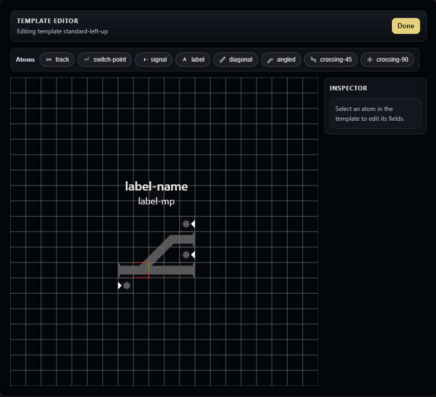

# Layout Guide for Beta Testers

This guide explains how to view layouts, enter the layout builder, create new layouts, place atoms, build templates, and map the live indexes that drive the UI.

## 1. Start the App

If this is your first time opening the package:

1. Unzip the package.
2. Open the extracted folder.
3. Run `Server.exe`.

After the server starts, open the app in the browser at `http://localhost:576`.

## 2. Open and Display a Layout

1. Start the app.
2. Open the browser page.
3. Use the layout drop-down in the top bar to choose the layout you want to view.

That is the short version. In normal monitor mode you are mostly just selecting a layout and watching it update.



## 3. Enter Layout Builder

To edit the current layout, click `Layout builder` in the top bar.

To leave the builder, click `Close builder` in the builder header. You can also return to monitor mode with the top bar button labeled `Return to monitor` after entering builder mode.



## 4. Start a New Layout

While in the builder, click `New layout`.

The app will prompt for:

1. Layout name
2. Canvas width in cells
3. Canvas height in cells

After that, the new layout opens in monitor mode. You will need to enter `Layout builder` again before placing items.

The new layout starts with the default signal stop values used by the app, and you can change them later in the layout settings panel.

## 5. Builder Basics

The builder gives you three things:

- the palette for placing items
- the canvas for arranging them
- the inspector for changing the selected item

The top bar gives you `Save layout`, `New layout`, and `Close builder`.

Save writes the current layout back to the server and returns you to monitor mode.



## 6. Place Main Layout Atoms

The main layout builder lets you place these atom kinds directly on the canvas:

- `track`
- `label`
- `diagonal`
- `angled`
- `portal`

If you need `switch-point`, `signal`, `crossing-45`, or `crossing-90`, put them in a template instead.

There is a strict 1 track atom per grid square rule. Do not layer switch points, straight track, diagonal track, or angled track on the same grid square.

To place one:

1. Drag the atom from the palette.
2. Drop it on the canvas.
3. Select it if you want to change its placement fields in the inspector.

### Common Atom Types

- `track`: straight connected rail
- `label`: free text on the layout
- `diagonal`: a diagonal connector
- `angled`: a corner connector
- `portal`: a jump from one place to another

### Atom Settings

Atoms are placed on the canvas, and the inspector only shows the placement fields that are available for that atom kind.

#### Track

- `Rotation`
- `Length`
- `Block end left`
- `Block end right`

#### Label

- `Text`
- `Size`
- `Color`
- `Offset X`
- `Offset Y`

#### Diagonal

- `Flip`

#### Angled

- `Rotation`

#### Portal

- `Pair ID`

### Notes for Atom Fields

- Position is always edited with `X` and `Y`.
- Leaving a field blank removes the value where the UI allows that behavior.

## 7. Move or Remove Placed Items

Select any item on the canvas to see its inspector fields.

You can then:

- change its `X` and `Y`
- change its available placement fields
- duplicate it
- delete it

If you select multiple items, the inspector switches to bulk mode and shows `Delete all`.

Helpful shortcuts:

- Use the arrow keys to move selected items by one grid cell.
- Hold `Ctrl` or `Cmd` while selecting to add items to the current selection.
- Right-click an item to open the context menu.

The context menu typically offers:

- `Select`
- `Duplicate`
- `Delete`
- `Copy`
- `Edit template` for custom template instances

### Documentation Checkpoint
Make a note of the word "wayside." You'll need it later.

## 8. Use Templates

Templates are reusable patterns that keep a control point together as one unit.

In the builder palette, templates are listed under:

- `Standard`
- `Custom`

You can drag a template chip onto the canvas to place a new template instance.

### Standard Templates

Standard templates are read only. They are built-in patterns such as:

- `standard-left-up`
- `standard-left-down`
- `standard-right-up`
- `standard-right-down`
- `block-signal-pair`

These are the best starting points for common control points and signal pairs.

### Custom Templates

Custom templates are patterns you create for a specific location.

Use a custom template when several pieces should move together as one reusable unit.

### Create a Custom Template

1. Click `+ New template`.
2. Enter a template name.
3. The template editor opens.
4. Add atoms to the template canvas.
5. Adjust the atom fields in the template inspector.
6. Click `Done` when you are finished.

### Open a Custom Template for Editing

You can open a custom template in a few ways:

- click the edit icon on the template chip
- double-click the template chip
- click `Edit template` on a custom template instance in the inspector

Standard templates are read only.

## 9. Template Editor

When you open a template, the builder shows a separate template editor overlay.

This editor has:

- its own canvas
- its own palette row
- its own inspector
- `Delete template`
- `Done`
- `Back to layout`

The template editor is where you build the reusable pattern itself, not the placed instance.

### Template Editor Palette

The template editor palette includes the atom types used to compose a template, including the ones that are not available in the main layout builder.

The current UI focuses on:

- `track`
- `switch-point`
- `signal`
- `label`
- `diagonal`
- `angled`
- `crossing-45`
- `crossing-90`

### Template Atom Settings

Template atom fields are similar to normal atom fields, but they are role-based instead of packet-index-based.

Every template atom has:

- `Role`
- `X`
- `Y`

Then the remaining fields depend on the atom kind.

For template switch points, signals, and crossings, the editor exposes the fields needed to define the reusable pattern.

For template signals, the editor uses `Track role` instead of `Signal index` or `Track ID`.

For template labels, the editor uses the label text and placement fields. The visible label text can be supplied later by the placed template instance.

### Template Editing Behavior

- Select an atom to edit it.
- Drag an atom to move it.
- Use `Duplicate` to create another copy.
- Use `Delete` to remove the selected template atom.
- Use `Delete all` when you have multiple atoms selected.

The editor keeps roles unique. When you duplicate an atom, the builder assigns a new role automatically.

### Template Placement and Cleanup

When you close the template editor, the builder normalizes the template position so the edited content stays anchored cleanly.

That means you should not worry about the template drifting out of bounds while you edit it.



## 10. Place Template Instances

A template instance is a placed copy of a template on the main layout canvas.

When you drop a template onto the canvas, the inspector shows fields for that instance.

### Instance Settings

The template instance inspector includes:

- `Template`
- `WIU`
- `Packet signal count`
- `Packet switch count`
- `Signal indexes`
- `Switch indexes`
- `Labels`

It may also show `Offset X` and `Offset Y` for template label placement.

### What the Fields Mean

- `Template` shows which reusable pattern this instance uses. In the current UI, this field is read-only after placement.
- `WIU` is the device or control-point ID that the layout listens to.
- `Packet signal count` defines how many signal packet slots the UI should consider for that instance.
- `Packet switch count` defines how many switch packet slots the UI should consider for that instance.
- `Signal indexes` maps template signal roles to packet positions.
- `Switch indexes` maps template switch roles to packet positions.
- `Labels` maps template label roles to visible text.

### Building a New Instance

When you place a template, the builder tries to prefill the mapping fields with `-1` for unassigned roles.

That is intentional. It gives you a starting point without forcing a guess.

## 11. Map Indexes

Index mapping is what connects the visual layout to the live data stream.

This is one of the most important parts of the builder.

### Signal Indexes

Signal indexes map template signal roles to the raw signal positions in the incoming data.

Use the `Signal indexes` section to choose the number for each role.

- `1` means first
- `2` means second
- `3` means third
- and so on

If a role is not used, leave it as `unassigned`.

### Switch Indexes

Switch indexes work the same way, but for switch packet positions.

Use the `Switch indexes` section to map each switch role to the correct packet slot.

### Label Texts

Template label roles can be filled with custom text in the `Labels` section.

This is how a reusable template can show different station names, DS numbers, or other labels each time it is placed.

### Hover and Highlight Help

When you focus an index field, the builder highlights the matching atom in the canvas. That makes it easier to confirm you mapped the right role.

### Unassigned Values

Use `-1` for a role that should not be connected to live packet data.

That is normal for a template that contains an optional or unused role.

## 12. Layout Settings

When nothing is selected, the inspector shows the layout settings panel.

These settings apply to the whole layout.

### Name

The layout name shown in the UI.

### Width

The number of grid cells across the canvas.

### Height

The number of grid cells tall the canvas is.

### Grid lines

Turns the editing grid on or off in the builder view.

This is a viewing aid and is not meant to be a layout content setting.

### Stop Signal Values

This field controls which raw signal values should appear as stop or red values in the UI.

Enter the values as a comma-separated list, for example:

```text
14, 15, 30
```

### Active timeout and Dim timeout

The builder shows two minute-based timeout settings:

- `Active timeout`
- `Dim timeout`

Use these to control how long live state stays fresh before the app treats it as stale and falls back to timeout behavior.

If you are unsure about the numbers, leave the defaults in place and only change them if you know the layout needs a different behavior.

## 13. Working With the Canvas

The canvas is grid-based, so a few habits make editing much easier:

- keep atoms aligned to the grid
- use the grid lines while building
- drag items only after selecting the right thing
- use the context menu for copy, duplicate, and delete
- watch the inspector as you move between layout items and templates

The app saves the layout as a single layout definition, so changes to templates and changes to placed items are both part of the same saved work. After a save, the app returns you to monitor mode.

## 14. Directional Conventions

These rules make layouts easier to read across the whole app.

- Signals should sit on the right side of the track in the direction of travel.

- Westbound routes should read left on the page and go up to new rows as they go further west.
- Eastbound routes should read right on the page and go down to new rows as they go further east.
- Northbound routes should generally read upward on the page and go to the right as they go further north.
- Southbound routes should generally read downward on the page and go to the left as they go further south.

- Features that are not directly related to signaling or routing, such as unsignaled sidings or industrial spurs, should generally be left out. Include those only when they are important for understanding the layout.

These are conventions, not hard physics. Some layouts will not follow perfect cardinal directions, and that is fine when the author makes a reasonable judgment call.

### Documentation Checkpoint
Add the word "device" to the word from the earlier checkpoint. DM me that phrase on Discord to confirm that you have thoroughly read this documentation

## 15. Common Workflows

### Add a New Track Segment

1. Open the builder.
2. Drag `track` onto the canvas.
3. Set the length.
4. Adjust block-end settings if needed.
5. Move the track until it lines up with neighboring pieces.

### Build a New Control Point from a Template

1. Place a template instance.
2. Set the `WIU`.
3. Map each signal index.
4. Map each switch index.
5. Fill in the label text.
6. Adjust offsets if the labels need a visual nudge.

### Turn a Repeated Pattern Into a Custom Template

1. Create a new custom template.
2. Add the atoms that make up the repeated pattern.
3. Assign clear, stable roles.
4. Add switch points, signals, and crossings as needed.
5. Save the template.
6. Place instances of that template on the main layout.

## 16. Quick Troubleshooting

If something does not look right, check these first:

- the layout or template was saved and then reopened
- the WIU is correct
- the signal and switch indexes are in the right order
- the label text is mapped to the right role
- the stop signal values match what the layout expects
- the item is not simply off the grid or overlapping something else

## 17. Final Checks

Before you consider the layout done, verify:

- the layout opens in monitor mode
- the layout enters builder mode cleanly
- any new layout saves without errors
- every item has the correct position and field values
- template instances have the correct WIU and index mapping
- templates open and close correctly
- labels are readable and do not cover nearby track
- the layout still looks correct after saving and reloading

If something looks wrong, the most common causes are:

- a bad WIU
- a signal or switch index mapped to the wrong number
- an unintentional `-1`
- a label that overlaps nearby items
- a template edited without updating its placed instances
